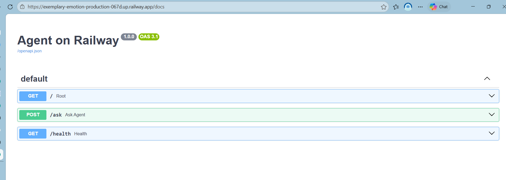

# Day 12 Lab - Mission Answers

## Part 1: Localhost vs Production

### Exercise 1.1: Anti-patterns found
1. API Key bị hardcore - nên cho đọc từ environment.
2. Không có config management, các tham số được để trực tiếp trong code
3. Print thay vì sử dụng Log
4. Cần thêm health check port để kiểm tra product chạy ổn chưa
5. Port cố định, cần đọc từ env.
...

### Exercise 1.3: Comparison table
| Feature | Basic | Advanced | Why Important? |
|---------|-------|----------|----------------|
| Config | Hardcode trực tiếp `OPENAI_API_KEY`, `DATABASE_URL`, `DEBUG`, `MAX_TOKENS` trong code | Đọc từ `settings` / environment variables | Tách config khỏi source code, tránh lộ secret, dễ đổi theo từng môi trường local, staging, production |
| Health check | Không có `/health` | Có `/health` trả về `status`, `uptime`, `version`, `timestamp` | Cloud platform cần health check để biết app còn sống và tự restart khi lỗi |
| Readiness check | Không có | Có `/ready`, trả `503` nếu app chưa sẵn sàng | Load balancer chỉ gửi traffic tới instance đã khởi động xong, tránh lỗi lúc startup |
| Logging | Dùng `print()` và còn log cả API key | Dùng structured JSON logging qua `logging` | Dễ tìm kiếm, phân tích log trên cloud và không làm lộ secrets |
| Shutdown | Không xử lý shutdown | Có `lifespan` shutdown và `SIGTERM` handler | Cho phép đóng kết nối gọn, hoàn tất request đang chạy trước khi container bị tắt |
| Host binding | Bind `localhost` | Bind theo `settings.host` (thường là `0.0.0.0`) | Container/cloud cần lắng nghe từ bên ngoài; `localhost` chỉ truy cập được trong máy đó |
| Port | Cố định `8000` | Dùng `settings.port` từ env `PORT` | Railway/Render thường inject port động, app phải đọc từ env mới chạy đúng |
| Debug/Reload | `reload=True`, `DEBUG=True` cố định | `reload=settings.debug` | Tránh bật chế độ debug ở production vì giảm ổn định và tăng rủi ro bảo mật |
| Input validation | `ask_agent(question: str)` khá sơ sài | Kiểm tra JSON body, báo `422` nếu thiếu `question` | Giúp API trả lỗi rõ ràng, tránh request sai format làm app xử lý mơ hồ |
| CORS | Không cấu hình | Có `CORSMiddleware` với `allowed_origins` từ config | Kiểm soát domain nào được gọi API từ browser, quan trọng khi public endpoint |

## Part 2: Docker

### Exercise 2.1: Dockerfile questions
1. Base image: `python:3.11` - image Python đầy đủ, dễ dùng để build bản basic.
2. Working directory: `/app`.
3. `COPY requirements.txt` trước để tận dụng Docker layer cache. Nếu source code thay đổi nhưng dependencies không đổi thì Docker không phải `pip install` lại, build nhanh hơn.
4. `CMD` là lệnh mặc định khi container start và có thể bị override lúc `docker run`. `ENTRYPOINT` dùng để cố định executable chính của container; tham số thêm vào thường được nối sau `ENTRYPOINT`. Trong file này dùng `CMD ["python", "app.py"]` để chạy app mặc định.

### Exercise 2.3: Multi-stage build
1. Stage 1 (`builder`) dùng để cài dependencies. Stage này có `gcc`, `libpq-dev`, chạy `pip install --user -r requirements.txt` và chỉ phục vụ quá trình build, không dùng để deploy.
2. Stage 2 (`runtime`) là image chạy thật trong production. Nó chỉ copy các package đã cài từ stage `builder`, copy source code cần thiết, tạo `appuser`, thêm `HEALTHCHECK`, rồi chạy app bằng `uvicorn`.
3. Image nhỏ hơn vì stage runtime không mang theo tool build như `gcc`, `apt` cache, hay các file tạm trong lúc cài package. Multi-stage chỉ giữ lại phần cần để chạy app nên image gọn, sạch và an toàn hơn.
4. Bảo mật tốt hơn vì container chạy bằng non-root user `appuser`, không phải `root`.

### Exercise 2.3: Image size comparison
- Develop: 1.15 GB
- Production: 160 MB
- Expected: image production nhỏ hơn rất nhiều, khoảng 86% so với develop.

## Part 3: Cloud Deployment

### Exercise 3.1: Railway deployment
- URL: https://exemplary-emotion-production-067d.up.railway.app/
- Screenshot: 

## Part 4: API Security

### Exercise 4.1-4.3: Test results
>> 4.1 {
    "detail": "Missing API key. Include header: X-API-Key: <your-key>"
}
>>
>> {
    "question": "hello",
    "answer": "Tôi là AI agent được deploy lên cloud. Câu hỏi của bạn đã được nhận."
}

>> 4.2 
>>
>> {
    "detail": "Authentication required. Include: Authorization: Bearer <token>"
}
>>
>>{
    "question": "hello",
    "answer": "Đây là câu trả lời từ AI agent (mock). Trong production, đây sẽ là response từ OpenAI/Anthropic.",
    "usage": {
        "requests_remaining": 9,
        "budget_remaining_usd": 2.1e-05
    }
}
>
>> 4.3 
> {
    "detail": {
        "error": "Rate limit exceeded",
        "limit": 10,
        "window_seconds": 60,
        "retry_after_seconds": 27
    }
}
### Exercise 4.4: Cost guard implementation
```python
import redis
from datetime import datetime

r = redis.Redis()

def check_budget(user_id: str, estimated_cost: float) -> bool:
    month_key = datetime.now().strftime("%Y-%m")
    key = f"budget:{user_id}:{month_key}"
    
    current = float(r.get(key) or 0)
    if current + estimated_cost > 10:
        return False
    
    r.incrbyfloat(key, estimated_cost)
    r.expire(key, 32 * 24 * 3600)  # 32 days
    return True
```
## Part 5: Scaling & Reliability

### Exercise 5.1-5.5: Implementation notes
**5.1 Health checks**

- `GET /health` được dùng làm liveness probe trong [05-scaling-reliability/develop/app.py](D:/day12_ha-tang-cloud_va_deployment/05-scaling-reliability/develop/app.py:104). Endpoint này trả về `status`, `uptime_seconds`, `version`, `environment`, `timestamp` và `checks` để cloud platform biết process còn sống hay không.
- `GET /ready` trong [05-scaling-reliability/develop/app.py](D:/day12_ha-tang-cloud_va_deployment/05-scaling-reliability/develop/app.py:147) được dùng làm readiness probe. Endpoint kiểm tra biến `_is_ready`; nếu app chưa startup xong hoặc đang shutdown thì trả `503`, còn nếu sẵn sàng thì trả `200` cùng số request đang xử lý.
- `_is_ready` được bật trong `lifespan` sau khi startup hoàn tất và bị tắt lại khi shutdown, nên load balancer có thể ngừng gửi traffic đúng thời điểm.

Test result:

```json
GET /health
{
  "status": "ok",
  "uptime_seconds": 1.4,
  "version": "1.0.0",
  "environment": "development",
  "timestamp": "2026-04-17T03:09:24.122824+00:00",
  "checks": {
    "memory": {
      "status": "ok",
      "note": "psutil not installed"
    }
  }
}
```

```json
GET /ready
{
  "ready": true,
  "in_flight_requests": 1
}
```

**5.2 Graceful shutdown**

- Graceful shutdown được triển khai bằng `lifespan` và signal handler trong [05-scaling-reliability/develop/app.py](D:/day12_ha-tang-cloud_va_deployment/05-scaling-reliability/develop/app.py:41) và [05-scaling-reliability/develop/app.py](D:/day12_ha-tang-cloud_va_deployment/05-scaling-reliability/develop/app.py:175).
- Khi app bắt đầu shutdown, `_is_ready` được chuyển sang `False` để từ chối request mới.
- Middleware `track_requests()` đếm `_in_flight_requests`, nhờ đó app biết còn bao nhiêu request đang chạy.
- Trong pha shutdown, app chờ tối đa 30 giây để các request đang xử lý hoàn tất rồi mới thoát.
- `signal.signal(signal.SIGTERM, handle_sigterm)` đăng ký bắt `SIGTERM`, còn `uvicorn.run(..., timeout_graceful_shutdown=30)` cho phép Uvicorn chờ shutdown sạch thay vì tắt đột ngột.

Expected behavior when testing:

```text
1. Start app: python app.py
2. Send a request to /ask
3. Send SIGTERM to the process
4. App logs graceful shutdown, stops accepting new requests, waits for in-flight requests, then exits cleanly
```

Observed startup log:

```text
2026-04-17 10:09:22,768 INFO Starting agent on port 8000
2026-04-17 10:09:22,802 INFO Agent starting up...
2026-04-17 10:09:22,802 INFO Loading model and checking dependencies...
2026-04-17 10:09:23,005 INFO Agent is ready!
```

**5.3 Stateless design**

- Phần production đã refactor sang stateless trong [05-scaling-reliability/production/app.py](D:/day12_ha-tang-cloud_va_deployment/05-scaling-reliability/production/app.py:59). Thay vì lưu `conversation_history` trong RAM theo user, app lưu session dưới key `session:{session_id}` bằng Redis qua các hàm `save_session()`, `load_session()` và `append_to_history()`.
- Endpoint `POST /chat` nhận `question` và `session_id`. Nếu chưa có `session_id`, app tạo mới bằng UUID; các request sau chỉ cần gửi lại `session_id` là có thể tiếp tục cùng một cuộc hội thoại dù request được xử lý bởi instance khác.
- Mỗi message được lưu thành JSON gồm `role`, `content`, `timestamp`; history được giới hạn 20 messages để tránh session phình quá lớn. Session cũng có TTL 3600 giây.
- Endpoint `GET /chat/{session_id}/history` đọc lại toàn bộ hội thoại từ Redis, chứng minh state nằm ngoài process. Đây là điều kiện cần để scale horizontal.
- Lưu ý: code có fallback sang `_memory_store` nếu Redis không sẵn sàng. Fallback này chỉ phù hợp để demo local; production muốn thật sự stateless thì Redis phải hoạt động.

**5.4 Load balancing**

- Bài 5.4 dùng [docker-compose.yml](D:/day12_ha-tang-cloud_va_deployment/05-scaling-reliability/production/docker-compose.yml:13) để chạy 3 service chính: `agent`, `redis`, `nginx`.
- `nginx` mở cổng `8080:80` và proxy request vào upstream `agent_cluster` trong [nginx.conf](D:/day12_ha-tang-cloud_va_deployment/05-scaling-reliability/production/nginx.conf:7). Docker DNS tên `agent` sẽ phân phối theo round-robin tới nhiều container agent khi scale.
- Header `X-Served-By` được thêm từ `$upstream_addr`, nên có thể quan sát request nào đi vào instance backend nào.
- Redis là shared state store, nên dù Nginx chuyển request sang agent khác thì session vẫn còn.

```text
1. 3 agent instances cùng start
2. Nginx nhận request tại http://localhost:8080
3. Các response /chat có trường served_by khác nhau
4. Nếu 1 instance chết, Nginx vẫn route sang instance còn lại
```

**5.5 Test stateless**

- File [test_stateless.py](D:/day12_ha-tang-cloud_va_deployment/05-scaling-reliability/production/test_stateless.py:21) gửi 5 request liên tiếp tới `http://localhost:8080/chat`.
- Request đầu tạo session mới; các request tiếp theo tái sử dụng cùng `session_id`.
- Script thu thập `served_by` để kiểm tra các request có đi qua nhiều instance khác nhau không.
- Cuối cùng script gọi `GET /chat/{session_id}/history` và kiểm tra tổng số message đã được lưu. Nếu history đầy đủ dù `served_by` thay đổi, điều đó chứng minh state không nằm trong memory của một instance đơn lẻ mà được chia sẻ qua Redis.


```text
- In ra Session ID
- Mỗi request hiển thị instance xử lý trong trường served_by
- Instances used có nhiều hơn 1 instance
- Total messages trong history khớp với số lượt chat đã gửi
- Kết luận: Session history preserved across all instances via Redis
```
